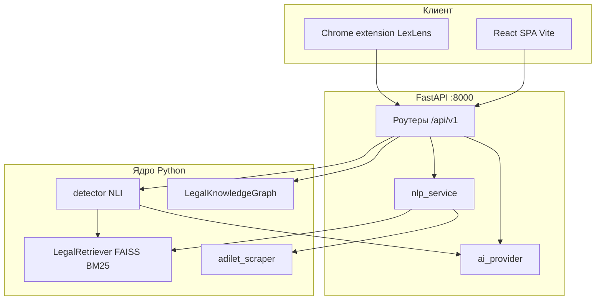

# LexLens — техническая документация

Документ описывает архитектуру репозитория **LexLens**, контракты API, данные, ML-компоненты, расширение браузера и эксплуатацию. Рабочая директория процессов — **корень репозитория** (где лежат `api/`, `src/`, `data/`).

---

## 1. Обзор системы

LexLens — прототип для анализа нормативных актов РК: гибридный семантический поиск, быстрый анализ документа, сравнение текстов, глобальный аудит коллизий (NLI + эвристики), граф связей (PyVis) и чат с RAG. LLM подключается через единый слой провайдеров; без ключа возможен режим **mock**.



---

## 2. Структура репозитория

| Путь | Назначение |
|------|------------|
| `api/` | FastAPI-приложение: `main.py`, роутеры, Pydantic-схемы, сервисы |
| `src/` | NLP/RAG: `retrieval/`, `embeddings/`, `reasoning/`, `graph/`, `scraper/` |
| `frontend/` | React 19 + TypeScript + Vite + Tailwind + Zustand |
| `extension/` | MV3-расширение LexLens (sidebar, background service worker) |
| `data/` | Парсинг, индексы, кэши, конфиг AI (см. §5) |
| `tests/` | Smoke-тесты API (`unittest`) |
| `pipeline.py` | CLI: сборка индекса, поиск, детекция коллизий, очистка |
| `requirements.txt` | Зависимости Python |
| `.env`, `.env.quicktest`, `.env.prod` | Переменные окружения (шаблон — `.env.example`) |

---

## 3. Backend (FastAPI)

### 3.1 Точка входа и конфигурация

- Файл: `api/main.py`.
- Загрузка env: `python-dotenv`, путь к файлу задаётся **`ENV_FILE`** (по умолчанию `.env`).
- CORS: список **`CORS_ORIGINS`** (через запятую); если пусто — разрешены типичные origin для `localhost` / `127.0.0.1` и regex для локальных портов.
- Документация OpenAPI: `http://127.0.0.1:8000/docs` (Swagger).

### 3.2 Сводная таблица REST API

Базовый префикс: **`/api/v1`**. Ниже — краткий контракт; полные модели — `api/models/schemas.py`.

| Метод | Путь | Описание |
|-------|------|----------|
| GET | `/health` | Проверка живости (не под `/api/v1`) |
| POST | `/search` | Гибридный поиск: тело `SearchRequest` (`query`, `top_k`, опционально `filters`, `doc_ids`) |
| GET | `/analyze/{doc_id}` | Смысловой разбор документа; query: `doc_ids[]`, `force_refresh` |
| GET | `/analyze/by-url` | То же по URL Adilet; query: `url`, опционально `doc_ids`, `force_refresh` |
| POST | `/chat` | Диалог с RAG; тело `ChatRequest` |
| POST | `/diff` | Семантический diff двух текстов/версий; тело `DiffRequest` |
| POST | `/index/build` | Скрапинг + добавление документов в индекс; тело `{ "doc_ids": ["K...", ...] }` |
| GET | `/index/preview/{doc_id}` | Метаданные и список версий с Adilet |
| GET | `/index/document/{doc_id}` | Полный текст из `data/parsed` (или догрузка архивной версии) |
| GET | `/index/document/by-url` | Query `url` — загрузка/разбор по ссылке |
| POST | `/audit/detect` | Глобальный аудит; тело `AuditRequest` (`doc_ids`, `force_refresh`) |
| GET | `/graph/html` | HTML графа PyVis; query: `filter_type`, `doc_ids`, `quicktest` (предпочтительно) или устаревший `demo` |
| GET | `/graph/heatmap` | JSON для Plotly heatmap; query: `doc_ids`, `quicktest` или `demo` |
| GET | `/settings/ai` | Текущий конфиг провайдера (частично из файла + env) |
| POST | `/settings/ai` | Сохранение настроек в `data/ai_config.json` |
| POST | `/settings/ai/test` | Проверочный вызов модели |
| GET | `/settings/ollama/models` | Список моделей Ollama |
| POST | `/precompute/all` | Прогрев кэшей analyze/audit/graph по списку или всему `data/parsed` |

### 3.3 Ключевые сервисы

- **`api/services/nlp_service.py`** — обёртка над `LegalRetriever`, поиск, быстрый анализ чанков, связка с графом.
- **`api/services/ai_provider.py`** — единая точка вызова LLM: читает **`data/ai_config.json`** и дополняет значениями из env. Провайдеры: `mock`, `azure`, `openai`, `anthropic`, `ollama`.
- **Кэширование**: ответы analyze и audit кладутся в `data/cache/` (JSON по ключам документа/области).

### 3.4 Ошибки

- HTTP 4xx — валидация (пустой запрос, неверный `doc_id`, и т.д.).
- HTTP 500 — необработанные исключения; сообщение в `detail` (в продакшене рекомендуется обернуть в единый формат без утечки стека).

---

## 4. Frontend

- **Стек**: React 19, React Router 7, Vite 8, Tailwind 3, Zustand, Axios, Plotly (граф/heatmap), react-markdown.
- **Сборка**: `npm run build`; режимы Vite: **`quicktest`** (быстрый тест UI), `production` (`npm run dev:quicktest`, переменная **`VITE_QUICK_TEST_MODE`**; для совместимости читается и `VITE_DEMO_MODE`).
- **Базовый URL API**: в `frontend/src/services/api.ts` задан `http://127.0.0.1:8000/api/v1` (для другого хоста — правка или proxy в `vite.config.ts`).
- **Маршруты** (`App.tsx`): `/` поиск, `/analyze/:docId`, `/diff`, `/audit`, `/graph`, `/settings`; боковая панель чата — `Sidebar.tsx`.

---

## 5. Данные и артефакты

Все пути относительно корня репозитория.

| Путь | Содержимое |
|------|------------|
| `data/parsed/*.json` | Иерархический JSON НПА после парсера (статьи, чанки, ссылки) |
| `data/raw/` | Сырые HTML (при скрапинге) |
| `data/faiss/faiss.index` | FAISS IndexFlatIP, размерность **384** |
| `data/faiss/bm25.pkl` | Сериализованный BM25Okapi |
| `data/embeddings/metadata.pkl` | Метаданные чанков (doc_id, текст, article_number, …) |
| `data/faiss/graph.pkl` | Сериализованный граф знаний (если построен) |
| `data/cache/` | Кэш analyze, audit, graph heatmap/html |
| `data/cache/graph/` | `demo_graph.html`, `demo_heatmap.json`, кэшированные `html_*.html` |
| `data/models/` | Кэш HuggingFace / sentence-transformers |
| `data/ai_config.json` | Активный провайдер и ключи (создаётся UI настроек) |

**Идентификаторы документов**: строки вида `K1400000235`; возможны суффиксы версий (`_ДД.ММ.ГГГГ`) для архива.

---

## 6. ML и алгоритмы

### 6.1 Эмбеддинги

- Модель: **`intfloat/multilingual-e5-small`** (`src/embeddings/embedder.py`).
- Кэш: `data/models/`.
- Запросы к поиску помечаются префиксом query/instruction согласно семейству e5.

### 6.2 Ретривер

- Класс: `src/retrieval/retriever.py` — `LegalRetriever`.
- **Гибридный поиск**: cosine (FAISS inner product на L2-нормированных векторах) + BM25, слияние **RRF** (Reciprocal Rank Fusion).
- Методы: `search_hybrid`, `search_within_document`, `add_documents`, `rebuild_index`.

### 6.3 NLI и аудит

- Модель: **`cointegrated/rubert-tiny-bilingual-nli`** (`src/reasoning/nli.py`).
- Детектор: `src/reasoning/detector.py` — `detect_all_problems`: устаревшие нормы (эвристики + поиск), пары кандидатов, батч NLI, объяснения (`explainer`, при необходимости LLM через `ai_caller`).
- Кэш NLI: `data/cache/nli_cache.json`.

### 6.4 Граф

- `src/graph/knowledge_graph.py` — `LegalKnowledgeGraph`, сборка из проблем аудита, генерация HTML (PyVis) и heatmap (Plotly).
- Устаревший вспомогательный модуль: `src/graph/law_graph.py` (NetworkX/PyVis).

### 6.5 Скрапер

- `src/scraper/adilet_scraper.py` — загрузка и разбор страниц **adilet.zan.kz**, пакетный парсинг `parse_batch`, версии `fetch_versions`, `fetch_by_url`.

---

## 7. CLI (`pipeline.py`)

Примеры:

```bash
python pipeline.py --build-index K1400000235 K2100000400
python pipeline.py --search "налоговая льгота"
python pipeline.py --detect-collisions
python pipeline.py --clean-database
```

Скрипты в `src/scripts/` (разовые задачи): `precompute_audit.py`, `expand_corpus.py`, `download_history.py`, `reclassify_added_ids.py` — смотрите argparse/докстринги в файлах.

---

## 8. Переменные окружения

| Переменная | Назначение |
|------------|------------|
| `ENV_FILE` | Путь к dotenv-файлу (например `.env.quicktest`) |
| `AI_PROVIDER` | `mock` \| `azure` \| `openai` \| `anthropic` \| `ollama` |
| `AZURE_OPENAI_*`, `OPENAI_*`, `ANTHROPIC_*`, `OLLAMA_*` | Учётные данные и модели |
| `AI_REQUEST_TIMEOUT_SEC` | Таймаут HTTP для LLM (по умолчанию **300** с; ранее было 20 с и давало `Request timed out` на Azure с медленными моделями) |
| `QUICK_TEST_MODE` | `1`/`true` — режим быстрого теста: кэшированный граф/heatmap без долгих пересчётов |
| `DEMO_MODE` | Устаревший алиас для `QUICK_TEST_MODE` (если `QUICK_TEST_MODE` не задан) |
| `GRAPH_FAST_MODE` | Ускоренный путь к кэшу графа |
| `CORS_ORIGINS` | Список origin через запятую для продакшена |

Файлы-примеры: `.env.example`, `.env.quicktest`, `.env.prod`.

---

## 9. Расширение Chrome (LexLens)

- Каталог: `extension/`.
- **Manifest V3**: `background.js` как ES module, импорты провайдеров AI.
- **Сообщения**: `AI_PROVIDER_CHAT`, `AI_SELECTION_PIPELINE`, `AI_TEST_PROVIDER`, `AI_CANCEL_REQUEST` — см. `background.js` и `api.js`.
- **Локальный бэкенд**: поиск связанных НПА — `POST http://127.0.0.1:8000/api/v1/search` из `background.js`.
- Установка: режим разработчика → «Загрузить распакованное» → выбрать папку `extension/`.
- Host permissions включают `127.0.0.1:8000` и провайдеров облака.

---

## 10. Тестирование

```bash
# из корня, с активированным venv
python -m unittest tests.test_api_smoke -v
```

Тесты используют `TestClient` и моки сети там, где указано. Для `test_preview_endpoint_*` нужен доступ к Adilet или актуальные фикстуры (тест может зависеть от внешней сети).

---

## 11. Сборка и деплой (ориентиры)

- **Backend**: `uvicorn api.main:app --host 0.0.0.0 --port 8000` (без `--reload` в проде).
- **Frontend**: `npm run build` → статика в `frontend/dist/`; отдача через nginx/CDN или прокси к API.
- Задать **`CORS_ORIGINS`** на реальный домен UI.
- Секреты не коммитить: только `ai_config.json` на сервере или переменные окружения.
- Учитывать объём RAM для PyTorch/sentence-transformers на CPU.

---

## 12. Известные ограничения

- Ответы LLM и эвристик NLI не являются юридическим заключением.
- Полный аудит по большому корпусу ресурсоёмкий (CPU, время).
- Первый запуск скачивает веса моделей (при отсутствии локального кэша).
- Расширение и UI рассчитаны на локальный API по умолчанию.

---

## 13. Лицензия проекта

См. `README.md` в корне (MIT, если не указано иное).
